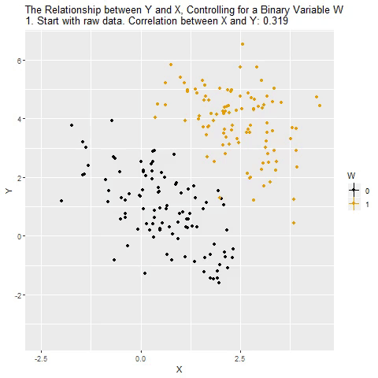

```{r xaringan-themer, include = FALSE}
library(xaringanthemer)
mono_light(
  base_color = "#23395b",
  header_font_google = google_font("Josefin Sans"),
  text_font_google   = google_font("Montserrat", "300", "300i"),
  code_font_google   = google_font("Droid Mono"),
)

library(tidyverse)
library(broom)
```

<style type="text/css">
.remark-slide-content {
    font-size: 30px;
    padding: 1em 4em 1em 4em;
}

.small .remark-code { 
  font-size: 80% !important;
}
.tiny .remark-code {
  font-size: 65% !important;
}
</style>

# This time/Last time
- Used a single coninuous predictors in a GLM
- Extending the GLM to multiple predictors

---
## Causal relationships
- Does parent SES cause better grades?
    + r(gpa, ses) = .33, b = .41
- Potential confound of peer relationships
    + r(ses, peer) = .29
    + r(gpa, peer) = .37
    
---
## Multiple ways variables can relate
- Spurious relationship
- Indirect (mediation)
- Moderate (interaction)
- Multiple "causes"

---
## Multiple regression model

$$\hat{Y} = b_{0} + b_{1}X_{1} + b_{2}X_{2}+...+b_{p}X_{p}$$

---
## Coefficient of Determination

$$R^2 = \frac{SS_{reggression}} {SS_{Y}} = \frac{s_{\hat{Y}}^2}{s_{Y}^2}$$

---
## GPA = SES + Peer relationships
-Can be thought of as overlapping Venn diagrams

```{r out.width = '50%', echo = FALSE}


```


---
## redundent vs non-redundent information 

```{r out.width = '80%', echo = FALSE}


```

---
## Types of correlations
- Pearson (our standard correlation measure) ignores all outside variables  
- Also called bi-variate correlation   

--

- Semi-partial: the extent to which the part of X1 that is independent of x2 correlates with all of Y
    
---
## Semi-partial

```{r out.width = '50%', echo = FALSE}


```

---
## Semi-partial
$$sr = r_{y(1.2)} = \frac{r_{Y1}-r_{Y2}r_{12} }{\sqrt{1-r_{12}^2}}$$
$$sr^2 = R_{Y.12}^2 - r_{Y2}^2$$

---
## Types of correlations
- Partial  
- The extent to which the part of X1  that is independent of X2  is correlated with the part of Y that is also independent of X2 

---
## Partial correlation

```{r out.width = '50%', echo = FALSE}


```

---
## Partial correlation
$$pr = r_{y1.2} = \frac{r_{Y1}-r_{Y2}r_{12} }{\sqrt{1-r_{Y2}^2}\sqrt{1-r_{12}^2}}$$

$$sr = r_{y(1.2)} = \frac{r_{Y1}-r_{Y2}r_{Y12} }{\sqrt{1-r_{12}^2}}$$
---
## Partial correlation

$$pr^2 = \frac{R_{Y.12}^2 - r_{Y2}^2}{1-r_{Y2}^2}$$

$$sr^2 = R_{Y.12}^2 - r_{Y2}^2$$
---
## Interpretting multiple regression model
$$\hat{Y} = b_{0} + b_{1}X_{1} + b_{2}X_{2}+...+b_{p}X_{p}$$  
- Intercept is when all predictors = 0  
- Regression coefficients are "partial" regression coefficients  
- Predicted change in y for a 1 unit change in x, *holding all other predictors constant* 
- Similar to semi-partial correlation in that Y variance is left alone

---
## How to interpret multiple regression cofficients? 
- Residual in simple regression can be thought of as a measure of Y that is left over after accounting for your DV
- Partial correlation can be created by:  
    1. create measure of X1 independent of X2
    2. create measure of Y independent of X2
    3. correlate new measures

---
## Example
.tiny[
```{r, echo = FALSE, message=FALSE}
Multipleregression <- read.csv("Multipleregression.csv")
```
```{r}
mr.model <- lm(Stress ~ Support + Anxiety, data = Multipleregression)
summary(mr.model)
```
]
---
```{r}
library(visreg)
visreg2d(mr.model,"Support", "Anxiety", plot.type = "persp")

```

---
## OLS
- similar to before
$$\hat{z}_{Y} = b_{1}^*Z_{X1} + b_{2}^*Z_{X2}$$
$$minimize \sum (z_{Y}-\hat{z}_{Y})^2$$

---
## Standardized partial regression coefficient
$$b_{1}^* = \frac{r_{Y1}-r_{Y2}r_{12}}{1-r_{12}^2}$$

$$b_{2}^* = \frac{r_{Y2}-r_{Y1}r_{12}}{1-r_{12}^2}$$
---
## Notice similarity with semi-partial correlation

$$b_{1}^* = \frac{r_{Y1}-r_{Y2}r_{12}}{1-r_{12}^2}$$


$$sr = r_{y(1.2)} = \frac{r_{Y1}-r_{Y2}r_{Y12} }{\sqrt{1-r_{12}^2}}$$

---
## Original metric

$$b_{1} = b_{1}^*\frac{s_{Y}}{s_{X1}}$$

$$b_{1}^* = b_{1}\frac{s_{X1}}{s_{Y}}$$

---
## Intercept

$$b_{0} = \bar{Y} - b_{1}\bar{X_{1}} - b_{2}\bar{X_{2}}$$

---
## How to visualize "controlling for"
.pull-left[
```{r, echo = FALSE}

```
]

.pull-right[
- example of x and y controlling for W. Taken from @nickchk 
]


---
## Fit revisited
.tiny[
```{r, echo = F}
summary(mr.model)
```
]

---
## Multiple correlation R

$$\hat{Y} = b_{0} + b_{1}X_{1} + b_{2}X_{2}$$


---
## Multiple correlation R

- $\hat{Y}$ is a linear combination of Xs
- $r_{Y\hat{Y}}$ = multiple correlation = R

---
## Multiple correlation R

$$R = \sqrt{b_{1}^*r_{Y1} + b_{2}^*r_{Y2}}$$
$$R^2 = {b_{1}^*r_{Y1} + b_{2}^*r_{Y2}}$$

---


```{r out.width = '90%', echo = FALSE}


```

---

```{r out.width = '80%', echo = FALSE}


```

---
## Significance tests

- R2 (omnibus)  
- Regression Coefficients  
- Increments to R2  

---
## R-squared

- Same as before  
- Adding predictors into your model will increase R2 – regardless of whether or not the predictor is correlated with Y.    
- Adjusted/Shrunken R2 takes into account the number of predictors in your model  
    
---
## Adjusted R-squared

$$R_{A}^2 = 1 - (1 -R^2)\frac{n-1}{n-p-1}$$
---


```{r}
anova(mr.model)
```


---
.tiny[
```{r}
summary(mr.model)
```
]
---
## Test of individual regression coefficients

$$H_{0}: \beta_{X}= 0$$
$$H_{1}: \beta_{X} \neq 0$$

---
## Test of individual regression coefficients

$$se_{b} = \frac{s_{Y}}{s_{X}}{\sqrt{\frac {1-r_{xy}^2}{n-2}}}$$

$$se_{b} = \frac{s_{Y}}{s_{X}}{\sqrt{\frac {1-R_{Y\hat{Y}}^2}{n-p-1}}} \sqrt{\frac {1}{1-R_{i.jkl...p}^2}}$$

- As N increases... 
- As variance explained increases... 

---
## Tolerance
$$se_{b} = \frac{s_{Y}}{s_{X}}{\sqrt{\frac {1-R_{Y\hat{Y}}^2}{n-p-1}}} \sqrt{\frac {1}{1-R_{i.jkl...p}^2}}$$  

- What cannot be explained in Xi by other predictors  
- Large tolerance (little overlap) means standard error will be small.   
- What does this mean for including a lot of variables in your model? 

---
## What to include?
- Match population model (theoretically)  
- Many variables will not bias parameter estimates but will increase degrees of freedom and standard errors, potentially

---
## Methods for entering variables
- Simultaneous
- Hierarchically 

---
## Simultaneous  
- How do you interpret the regression coefficient?
- How do you interpret the fit of the model? 

---
## Hierarchical / model comparison  
- When you want to see if the fit of one model is better than another  
- Aka incremental variance 

--  
 
- Multiple models are calculated  
- Each predictor (or set of predictors) is assessed in terms of what it adds (in terms of variance explained) at the time it is entered   
- Order is dependent on a priori hypothesis  


---

```{r out.width = '80%', echo = FALSE}


```

---
## R-square change
- Distributed as an F
$$F(p.new, N - 1 - p.all) = \frac {R_{full}^2- R_{reduced}^2} {1-R_{full}^2} (\frac {N-1-p.full}{p.reduced})$$
- can also be written in terms of SSresiduals

---
## Model comparisons
```{r}

m.1 <- lm(Stress ~ Support, data = Multipleregression)
m.2 <- lm(Stress ~ Support + Anxiety, data = Multipleregression)
anova(m.1, m.2)
```

---
## Model comparisons
```{r}
anova(m.1)
```

---
## Model comparisons
```{r}
anova(m.2)
```
---
## Model comparisons
.tiny[
```{r, echo = FALSE}
summary(m.2)
```
]
---
## Model comparisons
.tiny[
```{r, echo = FALSE}
summary(m.1)
```
]
---
## Model comparisons
```{r}
m.0 <- lm(Stress ~ 1, data = Multipleregression)
m.1 <- lm(Stress ~ Support, data = Multipleregression)
anova(m.0, m.1)
```


---
## Partitioning the variance
- It doesn't make sense to ask how much variance a variable explains (unless you qualify the association)

$$R_{Y.1234...p}^2 = r_{Y1}^2 + r_{Y(2.1)}^2 + r_{Y(3.21)}^2 + r_{Y(4.321)}^2 + ...$$

- In other words: order matters! 

---
## Group level multiple regression
- i.e., ANOVA models  
- Need to put numbers to our categories
- Dummy code is default
- Effect coding is an option
- Other types too (though most are unhelpful)

```{r, echo = FALSE, message=FALSE, warning=FALSE}
library(tidyverse)
library(forcats)
one.way <- read.csv("anova.csv")
one.way$group <- one.way$IV
one.way$group <- as.factor(one.way$group)
one.way <- one.way %>%
  mutate(group = fct_recode(group,
    "control"    = '0',
    "tx1"    = '1',
    "tx2"    = '2')) %>% 
  as_tibble()

```

---
## When working with factors
- know thy class
```{r}
class(one.way$group)
table(one.way$group)
```
- Many base R functions automatically convert character vectors to factors
- This is okay if you are just tossing into a regression model but problematic for many uses

---
## Group level multiple regression
.tiny[
```{r}
model.1 <- lm(drugs ~ group, data = one.way ) 
summary(model.1)
```
]

---
## What happened? 

- For every nominal/categorical variable that has more than 2 levels R (default R) automatically creates L-1 dummy variables  

- Each of these dummy variables consists of 0 & 1s just like before, except 1 group (the reference group) only is coded as a zero

- The interpretation of each coefficent is the difference between the group coded 1 and the reference group

---
## group means
```{r, message=FALSE}
library(dplyr)
(one.way %>% 
    group_by(group) %>% 
    filter(!is.na(drugs)) %>% 
    summarise(mean(drugs)))
```

---
## See what R is doing with contrasts function
- a part of every factor 
.tiny[
```{r}
contrasts(one.way$group)

# Can see the same with only 2 levels
contrasts(Multipleregression$group)
```
]
---
## Reordering
- no inherent order, so what does R spit out at you first? 
- default is alphabetic, but what if you wanted it by another variable

```{r}
levels(one.way$group)
one.way$group.2 <- relevel(one.way$group, "tx2")
levels(one.way$group.2)
```

---
```{r}
model.2 <- lm(drugs ~ group.2, data = one.way ) 
broom::tidy(summary(model.2))
contrasts(one.way$group.2)
```

---
## Contrasts
.tiny[
```{r}
## dummy variables via:
contr.treatment(4)
## effect coding via: 
contr.sum(4)
```
]

---
## Asign contrast to factor variable
.tiny[
```{r}
contr.sum(3)
contrasts(one.way$group) <- contr.sum(3)
model.3 <- lm(drugs ~ group, data = one.way ) 
tidy(model.3)
```
]
---
## effects (sum) coding
- note: intercept is the means of means
```{r, message=FALSE, warning=FALSE}
library(psych)
describe(one.way$drugs)
table(one.way$group)
```
- you may want to do "weighted" effect coding

--- 
```{r}
anova(model.3)
```
 - What does the ANOVA table look like for model.1 and model.2? 
 - note the df for SSregression/SSbetween
 
---
## what happens if you want a different reference group? 
- in addition to relevel (and fct_relevel in forcats) you can change the contrast matrix
.small[
```{r}
contrasts(one.way$group) <- contr.treatment(3, base = 2)
model.4 <- lm(drugs ~ group, data = one.way ) 
tidy(model.4)
```
]
---

```{r}
contrasts(one.way$group) <- contr.treatment(3, base = 3)
model.5 <- lm(drugs ~ group, data = one.way ) 
tidy(model.5)
```

---
## What happens if you have both nominal and continuous variables in the same model? 

```{r}
model.6 <- lm(drugs ~ group + alcohol, data = one.way ) 
tidy(model.6)
```

---
## How should you code variables to begin with?

- Easy enough to work with factor variables that have their level as their name
- No need to manually change (or create) a number associated with a level and use as.numeric
- For simple dichotomous variables, sometimes people do code 0/1 rather than tx/control for example
- Information could be lost without a code book, so best to name the variable what is coded 1 (e.g., tx or female rather than group or gender)

---
## Multicollinearity

---
## Supression 

